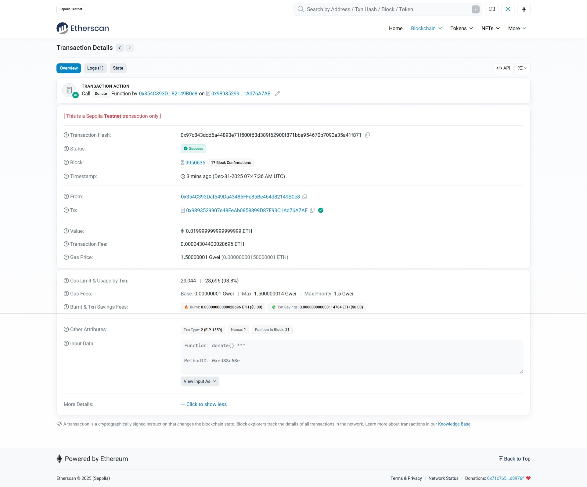
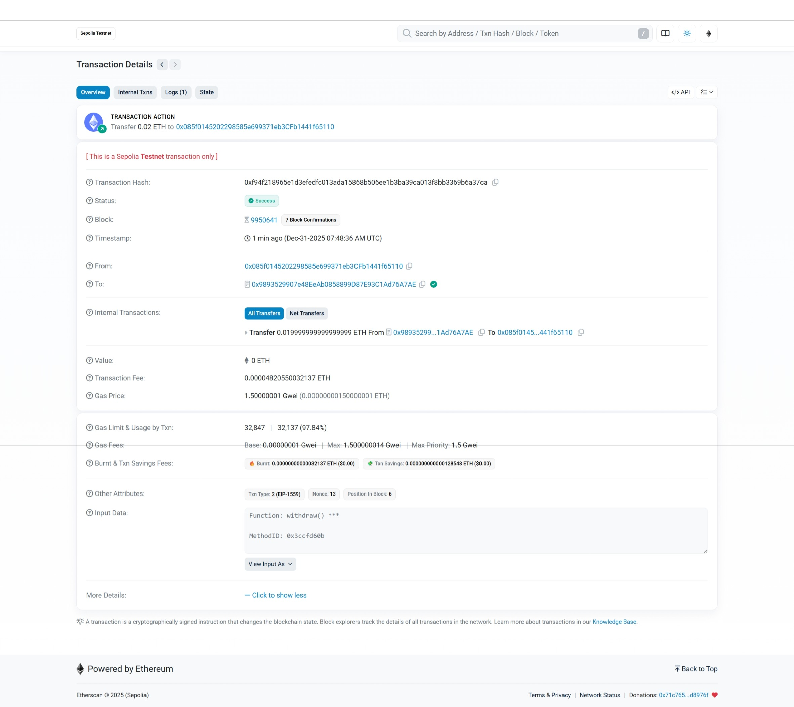

# BeggingContract 作业提交

---

## 📋 基础信息

| 项目 | 内容 |
|:------|:------|
| 网络 | Sepolia |
| 钱包地址 | `0x085f0145202298585e699371eb3CFb1441f65110` |
| 捐赠者地址 | `0x354c393daf549da43485ffe85be464d82149b0e8` |

---

## 📝 合约信息

| 项目 | 内容 |
|:------|:------|
| 合约文件 | `BeggingContract.sol` |
| 合约地址 | `0x9893529907e48EeAb0858899D87E93C1Ad76A7AE` |
| 部署交易 hash | `0xb792bc312f3c16cc948ff187a319633eb47825bf5f9fe914a66d096da0e31d59` |

---

## ✨ 测试交易

| 项目 | 内容 |
|:------|:------|
| donate 交易 hash | `0x97c843ddd6a44893e71f500f63d389f62900f871bba954670b7093e35a41f871` |
| withdraw 交易 hash | `0xf94f218965e1d3efedfc013ada15868b506ee1b3ba39ca013f8bb3369b6a37ca` |

---

## 📸 功能截图

### 1️⃣ Donate 捐款

> ✅ Remix 或 Etherscan，能看到 Success + Value

---

### 2️⃣ Withdraw 提现

> ✅ Remix 或 Etherscan，能看到 Success + 资金转出

