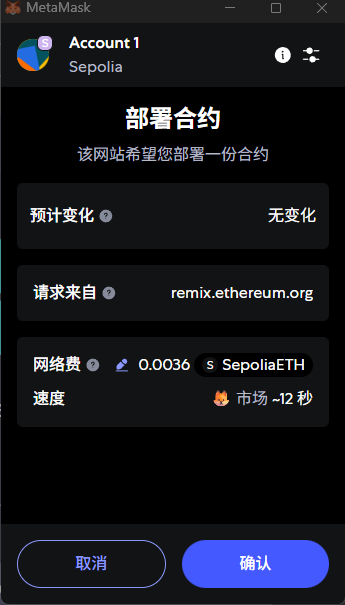
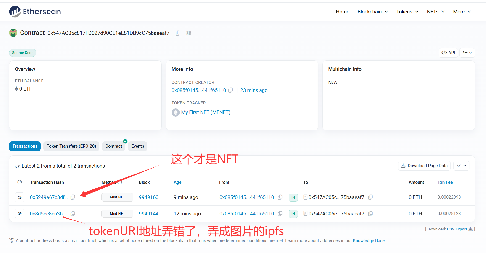
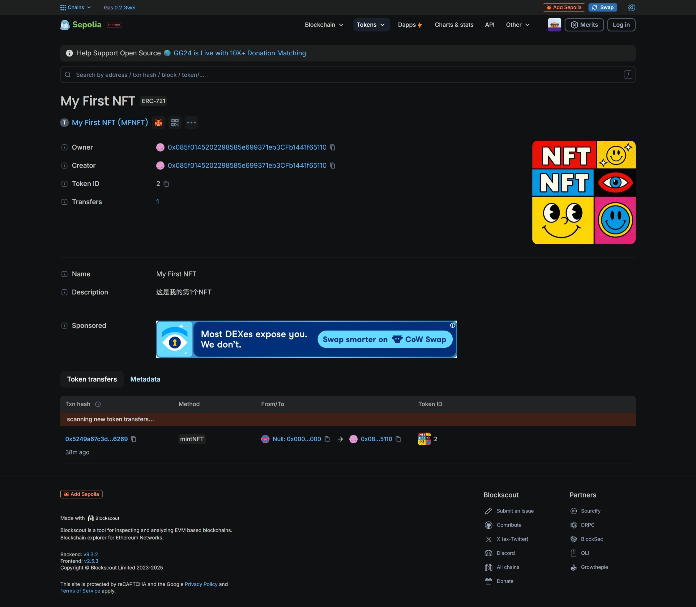

- **网络**：Sepolia
- **钱包地址（mint 的账户）**：`0x085f0145202298585e699371eb3cfb1441f65110`

- **合约信息**
  - **合约名**：`MyNFT`
  - **合约地址**：`0x547AC05c817FD027d90CE1eE81DB9cC75baaeaf7`
  - **部署交易 hash**：`0xf913adc76eb2bb61f27b8b4348becf645f380013f34ede3a48b36ce6f7c95661`

- **铸造信息**
  - **mint 交易 hash**：`0x5249a67c3df8b8487d72adaddfc6052809e469c2ba4be7c0fea9f68d0e946269`
  - **tokenId**：`2`
  - **tokenURI（metadata）**：`ipfs://bafkreihybznhkvtoxyexjek3rlft5votyirqlbxr5n73kakbekollmjboe`

- **IPFS 资源**
  - **metadata 网关验证链接**：`https://ipfs.io/ipfs/bafkreihybznhkvtoxyexjek3rlft5votyirqlbxr5n73kakbekollmjboe`（能看到 JSON）
  - **image（图片）**：`ipfs://bafybeiekahbtpgfpzwai352l4kiygxrius2bti4v2ipd34jukatgj5ckii`
  - **image 网关验证链接**：`https://ipfs.io/ipfs/bafybeiekahbtpgfpzwai352l4kiygxrius2bti4v2ipd34jukatgj5ckii`（能看到图片）
  - **metadata.json 原文**：
    ```
    {
        "name": "My First NFT",
        "description": "这是我的第1个NFT",
        "image": "ipfs://bafybeiekahbtpgfpzwai352l4kiygxrius2bti4v2ipd34jukatgj5ckii"
    }
    ```
- **展示结果**
  - **部署合约**  
    
  - **Etherscan 合约页截图**：能看到合约地址与交易列表  
    
  - **Etherscan mint 交易详情截图**：能看到状态 Success、To=合约地址、Input 里包含 tokenURI（或日志/事件）  
    
  
  - **Sepolia Blockscout（OpenSea测试网已经关闭） 测试网资产截图**：能看到图片 + 名称 + 描述（如果暂未刷新，说明“已等待X分钟/已刷新”）
  