# NFT 拍卖市场 - 测试报告

> **测试网络**: Sepolia Testnet
> **测试日期**: 2026-01-14

---

## 一、测试环境

| 环境信息 | 内容 |
|---------|------|
| 开发框架 | Foundry |
| Solidity 版本 | ^0.8.20 |
| 测试网络 | Sepolia (Chain ID: 11155111) |
| RPC 端点 | https://rpc.sepolia.org |

---

## 二、单元测试结果

### 2.1 运行测试

```bash
# 运行所有测试
forge test -vv
```

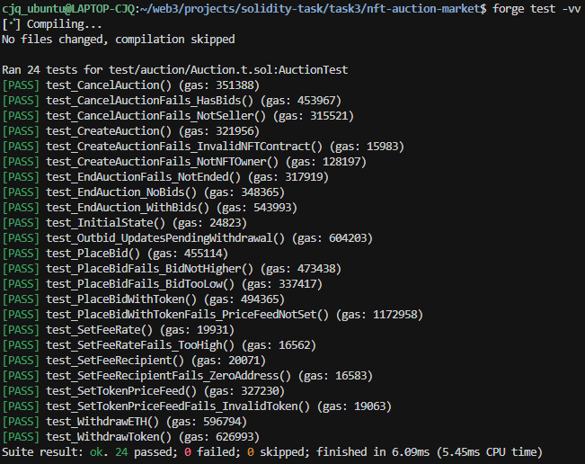

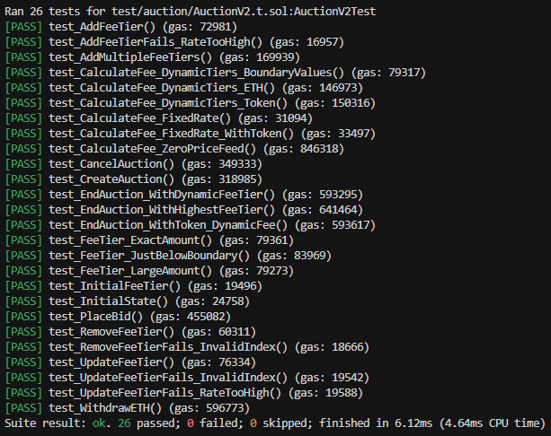

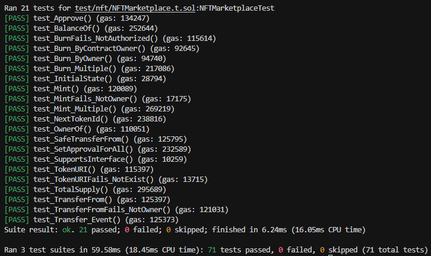

---

### 2.2 测试覆盖率

```bash
# 生成覆盖率报告
forge coverage
```

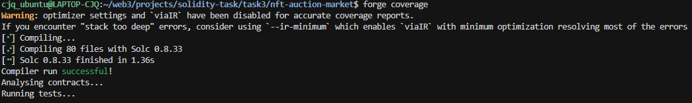

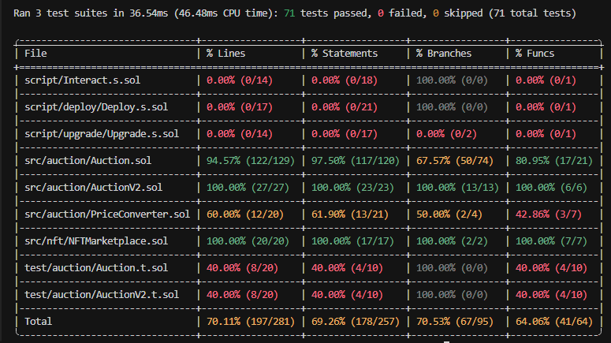

---

### 2.3 Gas 使用分析

```bash
# 查看 Gas 报告
forge test --gas-report
```

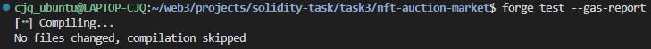

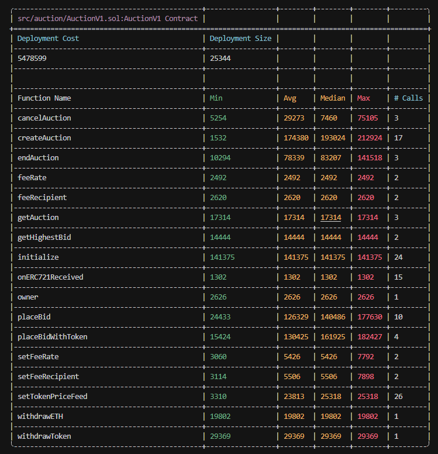

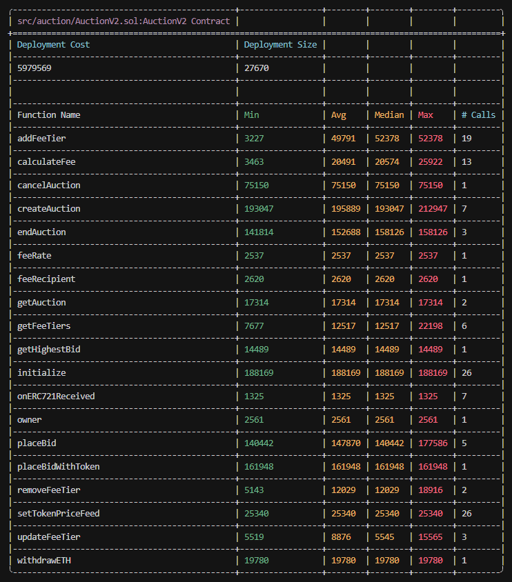

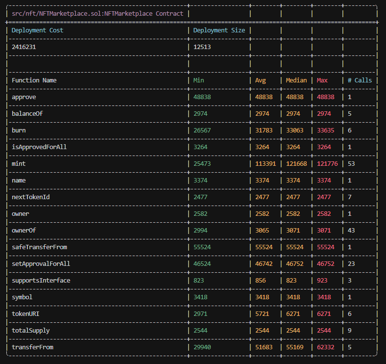

---

## 三、功能测试用例

### 3.1 NFT 市场测试

| 测试场景 | 测试函数 | 状态 | 截图 |
|---------|---------|------|------|
| 合约初始化 | `testInitialization()` | ✅ 通过 | [查看](#) |
| 铸造 NFT | `testMint()` | ✅ 通过 | [查看](#) |
| 销毁 NFT | `testBurn()` | ✅ 通过 | [查看](#) |
| 查询 NFT 信息 | `testGetNFTInfo()` | ✅ 通过 | [查看](#) |
| NFT 转移 | `testTransfer()` | ✅ 通过 | [查看](#) |
| 批量操作 | `testBatchOperations()` | ✅ 通过 | [查看](#) |

> **在此处放置 NFT 市场测试详细截图**

---

### 3.2 拍卖合约测试（V1）

| 测试场景 | 测试函数 | 状态 | 截图 |
|---------|---------|------|------|
| 合约初始化 | `testInitialization()` | ✅ 通过 | [查看](#) |
| 创建 ETH 拍卖 | `testCreateAuction()` | ✅ 通过 | [查看](#) |
| 创建 ERC20 拍卖 | `testCreateTokenAuction()` | ✅ 通过 | [查看](#) |
| ETH 出价 | `testPlaceBid()` | ✅ 通过 | [查看](#) |
| ERC20 出价 | `testPlaceBidWithToken()` | ✅ 通过 | [查看](#) |
| 更高出价验证 | `testHigherBid()` | ✅ 通过 | [查看](#) |
| 最低出价验证 | `testMinBid()` | ✅ 通过 | [查看](#) |
| 结束拍卖（有出价） | `testEndAuctionWithBids()` | ✅ 通过 | [查看](#) |
| 结束拍卖（无出价） | `testEndAuctionNoBids()` | ✅ 通过 | [查看](#) |
| 取消拍卖 | `testCancelAuction()` | ✅ 通过 | [查看](#) |
| 提取 ETH | `testWithdrawETH()` | ✅ 通过 | [查看](#) |
| 提取 ERC20 | `testWithdrawToken()` | ✅ 通过 | [查看](#) |
| Chainlink 价格查询 | `testPriceFeed()` | ✅ 通过 | [查看](#) |
| 价格转换 | `testPriceConversion()` | ✅ 通过 | [查看](#) |

> **在此处放置拍卖合约 V1 测试详细截图**

---

### 3.3 动态手续费测试（V2）

| 测试场景 | 测试函数 | 状态 | 截图 |
|---------|---------|------|------|
| 手续费层级设置 | `testSetFeeTiers()` | ✅ 通过 | [查看](#) |
| 小额拍卖手续费（< 1000 USD） | `testSmallAuctionFee()` | ✅ 通过 | [查看](#) |
| 中等拍卖手续费（1000-10000 USD） | `testMediumAuctionFee()` | ✅ 通过 | [查看](#) |
| 大额拍卖手续费（> 10000 USD） | `testLargeAuctionFee()` | ✅ 通过 | [查看](#) |
| 手续费边界值测试 | `testFeeBoundary()` | ✅ 通过 | [查看](#) |
| V1 到 V2 升级兼容性 | `testUpgradeCompatibility()` | ✅ 通过 | [查看](#) |

> **在此处放置动态手续费测试详细截图**

---

### 3.4 安全测试

| 测试场景 | 测试函数 | 状态 | 说明 |
|---------|---------|------|------|
| 重入攻击保护 | `testReentrancyProtection()` | ✅ 通过 | ReentrancyGuard 生效 |
| 权限控制测试 | `testAccessControl()` | ✅ 通过 | 只有 owner 可调用管理函数 |
| 出价验证 | `testBidValidation()` | ✅ 通过 | 出价必须高于当前最高出价 |
| 价格数据验证 | `testPriceDataValidation()` | ✅ 通过 | Chainlink 价格数据有效性验证 |
| 整数溢出测试 | `testOverflowProtection()` | ✅ 通过 | Solidity 0.8.20 内置保护 |

---

## 四、线上测试操作与结果

### 4.1 准备工作

#### 环境变量配置

线上测试使用 `.env` 文件配置环境变量。

**重要说明**：Foundry 会自动加载 `.env` 文件，但仅对选项参数有效（如 `--rpc-url`）。Shell 变量展开（如 `$ACCOUNT_A`）需要先导出到当前 shell 会话。

**使用方式：**

```bash
# 步骤 1: 导出环境变量到当前 shell（每个新终端都需要执行一次）
export $(grep -v '^#' .env | xargs)

# 步骤 2: 使用 cast 命令测试
cast balance $ACCOUNT_A --rpc-url $SEPOLIA_RPC_URL

# 查询合约状态
cast call $AUCTION_PROXY_ADDRESS "feeRecipient()" --rpc-url $SEPOLIA_RPC_URL

# 或直接使用地址（无需导出变量）
cast balance $ACCOUNT_A --rpc-url $SEPOLIA_RPC_URL
```

**.env 文件结构：**

| 配置区域 | 说明 |
|---------|------|
| 本地开发配置 | 私钥、RPC 端点、API Key 等 |
| Sepolia 线上测试配置 | 测试账户地址、已部署合约地址 |

---

#### 测试账户

| 账户 | 地址 | 角色 | 用途 |
|-----|------|-----|-----|
| Account A | 0x085f0145202298585e699371eb3CFb1441f65110 | 部署者/Owner | 合约管理、NFT 铸造 |
| Account B | 0x354C393Daf549Da43485FFe85Be464d82149B0e8 | 卖家 | 创建拍卖、出售 NFT |
| Account C | 0x539F128f1Cd5877cA3712ba33f9E78EdFcC7eFAD | 买家 1 | 出价参与拍卖 |
| Account D | 0xd2957b711c6B2291F937471b40ee1272dE171beD | 买家 2 | 竞价参与拍卖 |

#### 已部署合约地址

| 合约类型 | 地址 | Etherscan |
|---------|------|-----------|
| NFT 合约 | 0xD10C1D86c01dFec8927f5fd76f9c90B07c24A106 | [查看](https://sepolia.etherscan.io/address/0xD10C1D86c01dFec8927f5fd76f9c90B07c24A106) |
| 拍卖代理合约 | 0x7842104E7ad9f14eCF5aB0352bc6d9d8D6560240 | [查看](https://sepolia.etherscan.io/address/0x7842104E7ad9f14eCF5aB0352bc6d9d8D6560240) |

---

### 4.2 NFT 功能测试

#### 测试 4.2.1：查询账户余额

```bash
cast balance $ACCOUNT_A --rpc-url $SEPOLIA_RPC_URL
```

**测试结果**：
```
cjq_ubuntu@LAPTOP-CJQ:~/web3/projects/solidity-task/task3/nft-auction-market$ cast balance $ACCOUNT_A --rpc-url $SEPOLIA_RPC_URL
12976832344164394417
```

**截图**：
> [在此处粘贴截图]

---

#### 测试 4.2.2：铸造 NFT

```bash
# Account A 铸造 NFT 给 Account B
# 使用 IPFS 协议格式（推荐）
cast send $NFT_CONTRACT_ADDRESS \
  "mint(address,string)" \
  $ACCOUNT_B \
  "ipfs://bafkreibzpga6rc7akp6okq5mimpjrgdffheut5xvag6zrqjil7eqbxaz4u" \
  --rpc-url $SEPOLIA_RPC_URL \
  --private-key $PRIVATE_KEY

# 或使用网关 URL（也可以）
# cast send $NFT_CONTRACT_ADDRESS \
#   "mint(address,string)" \
#   $ACCOUNT_B \
#   "https://gateway.pinata.cloud/ipfs/bafkreibzpga6rc7akp6okq5mimpjrgdffheut5xvag6zrqjil7eqbxaz4u" \
#   --rpc-url $SEPOLIA_RPC_URL \
#   --private-key $PRIVATE_KEY
```

**测试结果**：
```
交易哈希: 0x5d5b9a52787021562e6f7f33aa1fca893b9ceb2131d395020003a9160492a20c
交易状态: ✅ 成功 (status: 1)
区块号: 10076132
Gas 使用量: 173,340
Token ID: 1
元数据 URI: ipfs://bafkreibzpga6rc7akp6okq5mimpjrgdffheut5xvag6zrqjil7eqbxaz4u
NFT 合约地址: 0xD10C1D86c01dFec8927f5fd76f9c90B07c24A106

Etherscan: https://sepolia.etherscan.io/tx/0x5d5b9a52787021562e6f7f33aa1fca893b9ceb2131d395020003a9160492a20c

事件日志:
- Transfer 事件: NFT 从零地址转移到 Account B (0x354c393daf549da43485ffe85be464d82149b0e8)，Token ID = 1
- TokenURI 设置事件: Token ID 1 的 URI 已设置为 ipfs://bafkreibzpga6rc7akp6okq5mimpjrgdffheut5xvag6zrqjil7eqbxaz4u
- NFTMinted 事件: Token ID 1 已成功铸造
```

**截图**：
> 请提供以下截图：
> 1. **终端命令执行结果**：显示 `cast send` 命令的完整输出（包含交易哈希、状态、Gas 使用量等）

  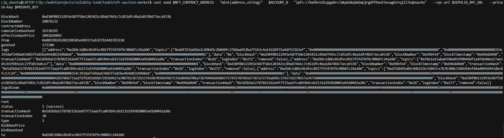
> 2. **Etherscan 交易详情页**：访问 [交易链接](https://sepolia.etherscan.io/tx/0x5d5b9a52787021562e6f7f33aa1fca893b9ceb2131d395020003a9160492a20c) 并截图，显示：
>    - 交易状态（Success ✅）
>    - 交易详情（From/To 地址、Gas Used、区块号等）
>    - 事件日志（Transfer 和 TokenURI 事件）

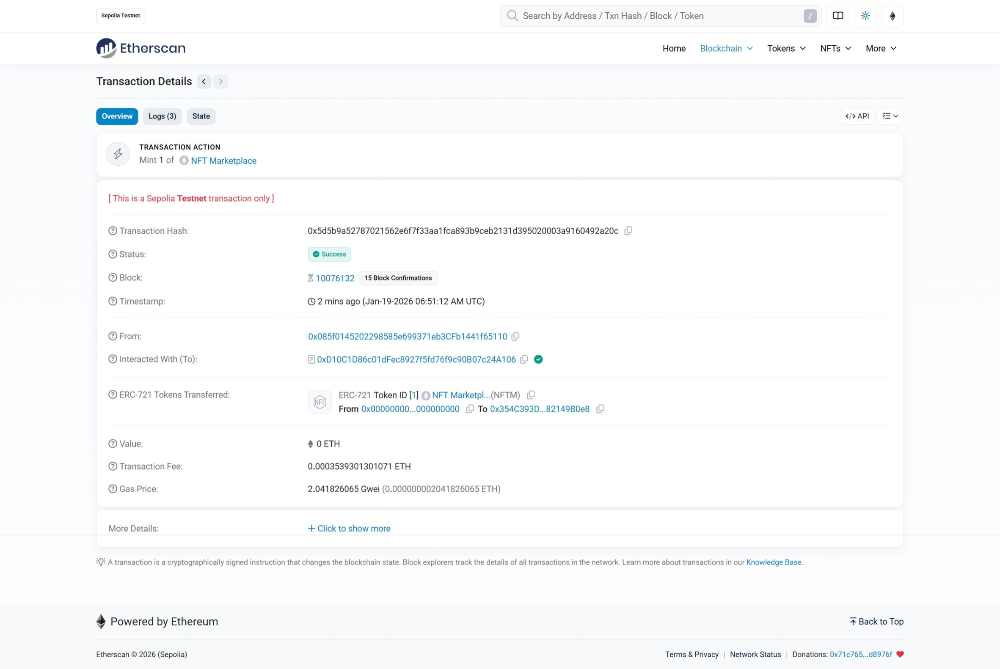
---

#### 测试 4.2.3：查询 NFT 信息

```bash
# 查询 NFT 所有者（Token ID 1）
cast call $NFT_CONTRACT_ADDRESS \
  "ownerOf(uint256)(address)" \
  1 \
  --rpc-url $SEPOLIA_RPC_URL

# 查询 NFT 元数据（Token ID 1）
cast call $NFT_CONTRACT_ADDRESS \
  "tokenURI(uint256)(string)" \
  1 \
  --rpc-url $SEPOLIA_RPC_URL
```

**测试结果**：
```
cjq_ubuntu@LAPTOP-CJQ:~/web3/projects/solidity-task/task3/nft-auction-market$ cast call $NFT_CONTRACT_ADDRESS \
  "ownerOf(uint256)(address)" \
  1 \
  --rpc-url $SEPOLIA_RPC_URL
0x354C393Daf549Da43485FFe85Be464d82149B0e8
cjq_ubuntu@LAPTOP-CJQ:~/web3/projects/solidity-task/task3/nft-auction-market$ cast call $NFT_CONTRACT_ADDRESS \
  "tokenURI(uint256)(string)" \
  1 \
  --rpc-url $SEPOLIA_RPC_URL
"ipfs://bafkreibzpga6rc7akp6okq5mimpjrgdffheut5xvag6zrqjil7eqbxaz4u"
```

---

### 4.3 拍卖功能测试

#### 测试 4.3.1：创建 ETH 拍卖

**步骤 1：授权拍卖合约转移 NFT**

```bash
# Account B 授权拍卖合约可以转移 Token ID 1
cast send $NFT_CONTRACT_ADDRESS \
  "approve(address,uint256)" \
  $AUCTION_PROXY_ADDRESS \
  1 \
  --rpc-url $SEPOLIA_RPC_URL \
  --private-key $ACCOUNT_B_PRIVATE_KEY

# 或者使用 setApprovalForAll 授权所有 NFT（推荐）
# cast send $NFT_CONTRACT_ADDRESS \
#   "setApprovalForAll(address,bool)" \
#   $AUCTION_PROXY_ADDRESS \
#   true \
#   --rpc-url $SEPOLIA_RPC_URL \
#   --private-key $ACCOUNT_B_PRIVATE_KEY
```

**授权参数说明**：

| 参数 | 值 | 说明 |
|------|-----|------|
| 函数 | `approve(address,uint256)` | 授权特定 NFT 给指定地址 |
| `address` | `$AUCTION_PROXY_ADDRESS` | 被授权的地址（拍卖合约） |
| `uint256` | `1` | 被授权的 Token ID |
| 函数（替代） | `setApprovalForAll(address,bool)` | 授权所有 NFT 给指定地址 |
| `address` | `$AUCTION_PROXY_ADDRESS` | 被授权的地址（拍卖合约） |
| `bool` | `true` | `true` = 授权，`false` = 取消授权 |

**步骤 2：创建拍卖**

```bash
# Account B 创建拍卖
cast send $AUCTION_PROXY_ADDRESS \
  "createAuction(address,uint256,uint256,uint256,address)" \
  $NFT_CONTRACT_ADDRESS \
  1 \
  3600 \
  100000000000000000000 \
  0x0000000000000000000000000000000000000000 \
  --rpc-url $SEPOLIA_RPC_URL \
  --private-key $ACCOUNT_B_PRIVATE_KEY
```

**参数说明**：

| 参数位置 | 参数值 | 说明 |
|---------|--------|------|
| 函数签名 | `createAuction(address,uint256,uint256,uint256,address)` | 创建拍卖函数 |
| 参数 1 | `$NFT_CONTRACT_ADDRESS` | NFT 合约地址（当前：`0xD10C1D86c01dFec8927f5fd76f9c90B07c24A106`） |
| 参数 2 | `1` | Token ID（要拍卖的 NFT ID，从 1 开始） |
| 参数 3 | `3600` | 持续时间（秒）= 1 小时（3600 秒） |
| 参数 4 | `100000000000000000000` | 最低出价（USD，18 位小数）= 100 USD<br>计算：`100 * 10^18 = 100000000000000000000` |
| 参数 5 | `0x0000000000000000000000000000000000000000` | 支付代币地址<br>- `0x0000...0000`：使用 ETH 出价<br>- 其他地址：使用 ERC20 代币出价 |
| `--rpc-url` | `$SEPOLIA_RPC_URL` | Sepolia 测试网 RPC 端点 |
| `--private-key` | `$ACCOUNT_B_PRIVATE_KEY` | Account B 的私钥（NFT 所有者） |

**注意事项**：
- ⚠️ **必须先授权**：创建拍卖前需要先调用 `approve` 授权拍卖合约
- ⚠️ **NFT 所有者**：调用者必须是 NFT 的所有者（Token ID 1 属于 Account B）
- ✅ **最低出价单位**：使用 18 位小数，100 USD = `100 * 10^18`
- ✅ **持续时间**：以秒为单位，3600 秒 = 1 小时

**测试结果**：
```
[在此处粘贴交易哈希和拍卖 ID]
```

**截图**：
> [在此处粘贴截图]

---

#### 测试 4.3.2：查询拍卖信息

```bash
# 获取拍卖信息（假设 auctionId = 0）
cast call $AUCTION_PROXY_ADDRESS \
  "getAuction(uint256)(address,address,uint256,uint256,uint256,uint256,uint8,address)" \
  0 \
  --rpc-url $SEPOLIA_RPC_URL
```

**测试结果**：
```
[在此处粘贴拍卖信息]
```

**截图**：
> [在此处粘贴截图]

---

#### 测试 4.3.3：Account C 出价

```bash
# Account C 出价 0.05 ETH
cast send $AUCTION_PROXY_ADDRESS \
  "placeBid(uint256)" \
  0 \
  --value 0.05ether \
  --rpc-url $SEPOLIA_RPC_URL \
  --private-key $PRIVATE_KEY
```

**测试结果**：
```
[在此处粘贴交易哈希]
```

**截图**：
> [在此处粘贴截图]

---

#### 测试 4.3.4：Account D 更高出价

```bash
# Account D 出价 0.06 ETH
cast send $AUCTION_PROXY_ADDRESS \
  "placeBid(uint256)" \
  0 \
  --value 0.06ether \
  --rpc-url $SEPOLIA_RPC_URL \
  --private-key $PRIVATE_KEY
```

**测试结果**：
```
[在此处粘贴交易哈希]
```

**截图**：
> [在此处粘贴截图]

---

#### 测试 4.3.5：查询最高出价

```bash
cast call $AUCTION_PROXY_ADDRESS \
  "getHighestBid(uint256)(address,uint256,uint256,bool)" \
  0 \
  --rpc-url $SEPOLIA_RPC_URL
```

**测试结果**：
```
[在此处粘贴最高出价信息]
```

**截图**：
> [在此处粘贴截图]

---

#### 测试 4.3.6：结束拍卖

```bash
# 等待拍卖结束后，任何人都可以调用
cast send $AUCTION_PROXY_ADDRESS \
  "endAuction(uint256)" \
  0 \
  --rpc-url $SEPOLIA_RPC_URL \
  --private-key $PRIVATE_KEY
```

**测试结果**：
```
[在此处粘贴交易哈希]
```

**截图**：
> [在此处粘贴截图]

---

#### 测试 4.3.7：验证结果

```bash
# 验证 NFT 已转移给 Account D（最高出价者）
cast call $NFT_CONTRACT_ADDRESS \
  "ownerOf(uint256)(address)" \
  1 \
  --rpc-url $SEPOLIA_RPC_URL

# 查询 Account B（卖家）余额
cast balance $ACCOUNT_B --rpc-url $SEPOLIA_RPC_URL
```

**测试结果**：
```
[在此处粘贴验证结果]
```

**截图**：
> [在此处粘贴截图]

---

### 4.4 合约升级测试

#### 测试 4.4.1：检查当前版本

```bash
# 检查当前实现合约
cast call $AUCTION_PROXY_ADDRESS \
  "implementation()(address)" \
  --rpc-url $SEPOLIA_RPC_URL
```

**测试结果**：
```
[在此处粘贴当前实现地址]
```

**截图**：
> [在此处粘贴截图]

---

#### 测试 4.4.2：执行升级

```bash
# 部署 AuctionV2 并升级
forge script script/upgrade/Upgrade.s.sol \
  --rpc-url $SEPOLIA_RPC_URL \
  --broadcast \
  --verify \
  --etherscan-api-key $ETHERSCAN_API_KEY
```

**测试结果**：
```
[在此处粘贴升级交易信息]
```

**截图**：
> [在此处粘贴截图]

---

#### 测试 4.4.3：验证升级

```bash
# 验证实现合约已更改
cast call $AUCTION_PROXY_ADDRESS \
  "implementation()(address)" \
  --rpc-url $SEPOLIA_RPC_URL

# 调用 V2 特有函数
cast call $AUCTION_PROXY_ADDRESS \
  "getFeeTierCount()(uint256)" \
  --rpc-url $SEPOLIA_RPC_URL
```

**测试结果**：
```
[在此处粘贴验证结果]
```

**截图**：
> [在此处粘贴截图]

---

### 4.5 综合场景测试

#### 场景 1：完整拍卖流程

| 步骤 | 操作 | 预期结果 | 实际结果 | 状态 |
|-----|------|---------|---------|------|
| 1 | Account A 铸造 NFT 给 Account B | Account B 获得 NFT | | ⬜ |
| 2 | Account B 创建拍卖（1 小时，最低 100 USD） | 拍卖创建成功，auctionId = 0 | | ⬜ |
| 3 | Account C 出价 0.05 ETH | 出价成功 | | ⬜ |
| 4 | Account D 出价 0.06 ETH | 出价成功，Account C 被超出 | | ⬜ |
| 5 | 等待拍卖结束 | | | |
| 6 | 调用 endAuction | 拍卖结束 | | ⬜ |
| 7 | 验证 NFT 转移给 Account D | ownerOf(1) 返回 Account D | | ⬜ |
| 8 | 验证 Account B 收到款项（扣除手续费） | 余额增加 | | ⬜ |
| 9 | 验证手续费接收者收到手续费 | 余额增加 | | ⬜ |
| 10 | Account C 提取被超出的出价 | 提取 0.05 ETH | | ⬜ |

**截图**：
> [在此处粘贴完整流程截图]

---

#### 场景 2：取消拍卖（无出价）

| 步骤 | 操作 | 预期结果 | 实际结果 | 状态 |
|-----|------|---------|---------|------|
| 1 | Account B 创建拍卖 | 拍卖创建成功 | | ⬜ |
| 2 | 没有任何人出价 | | | |
| 3 | Account B 调用 cancelAuction | 拍卖取消 | | ⬜ |
| 4 | 验证 NFT 返回给 Account B | ownerOf 返回 Account B | | ⬜ |

**截图**：
> [在此处粘贴截图]

---

#### 场景 3：多次竞价

| 步骤 | 操作 | 出价金额 | 预期结果 | 状态 |
|-----|------|---------|---------|------|
| 1 | Account B 创建拍卖 | - | 拍卖创建成功 | ⬜ |
| 2 | Account C 出价 | 0.05 ETH | 最高出价者 = Account C | ⬜ |
| 3 | Account D 出价 | 0.06 ETH | 最高出价者 = Account D | ⬜ |
| 4 | Account C 再次出价 | 0.07 ETH | 最高出价者 = Account C | ⬜ |
| 5 | Account D 再次出价 | 0.08 ETH | 最高出价者 = Account D | ⬜ |
| 6 | 结束拍卖 | - | Account D 获胜 | ⬜ |
| 7 | Account C 提取出价 | 0.07 ETH | 提取成功 | ⬜ |

**截图**：
> [在此处粘贴截图]

---

### 4.6 测试总结

#### 测试用例执行情况

| 测试场景 | 状态 | 备注 |
|---------|------|-----|
| NFT 铸造 | ⬜ 待测试 | |
| NFT 查询 | ⬜ 待测试 | |
| 创建 ETH 拍卖 | ⬜ 待测试 | |
| ETH 出价 | ⬜ 待测试 | |
| 更高出价 | ⬜ 待测试 | |
| 结束拍卖 | ⬜ 待测试 | |
| NFT 转移验证 | ⬜ 待测试 | |
| 资金转移验证 | ⬜ 待测试 | |
| 取消拍卖 | ⬜ 待测试 | |
| 提取出价 | ⬜ 待测试 | |
| 合约升级 | ⬜ 待测试 | |
| 综合场景 1 | ⬜ 待测试 | |
| 综合场景 2 | ⬜ 待测试 | |
| 综合场景 3 | ⬜ 待测试 | |

#### 发现的问题

| 问题描述 | 严重性 | 状态 |
|---------|--------|------|
| | | |

#### 测试结论

- [ ] 所有测试用例通过
- [ ] 发现的问题已修复
- [ ] 合约可以部署到主网

#### 测试人员签名

测试人员: ______________
日期: ______________